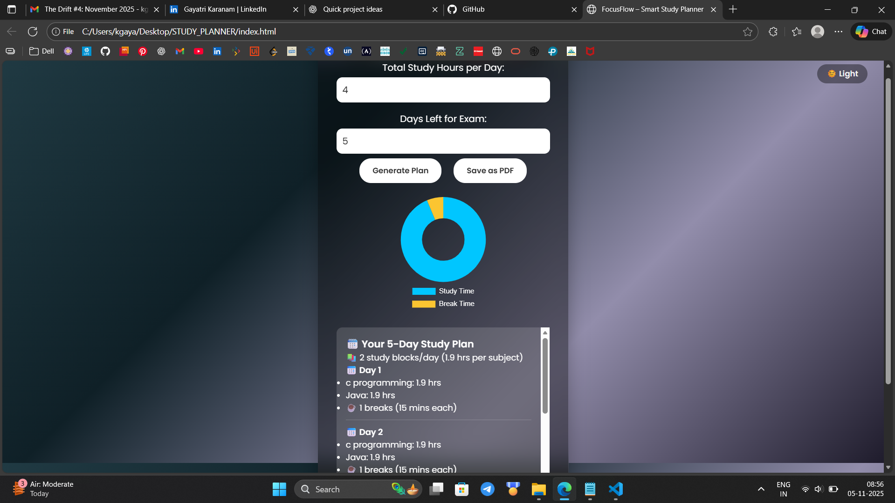

# 🎯 FocusFlow – Smart Study Planner

A beautiful, intelligent **Study Planner Web App** that helps you stay productive and balanced during your study sessions.  
It creates a personalized study schedule with perfect study–break ratio, motivational tips, and visual insights.

---

## 🌈 Features

✨ **Smart Schedule Generator**  
Automatically divides your total hours into balanced study sessions with proper breaks.

🌙 **Light / Dark Theme**  
Switch between cozy dark mode or vibrant light mode anytime.

📊 **Visual Analytics**  
See your **Study vs Break time** clearly in an animated circular chart (powered by Chart.js).

💬 **Motivational Tips & Quotes**  
Stay focused with random positive affirmations every time you plan.

🧾 **Save as PDF**  
Export your personalized daily plan instantly for offline use.

🎨 **Modern UI**  
Smooth glassmorphism design + animated gradient background for a calm, focused feel.

---

## 🧠 Tech Stack
- **HTML5**
- **CSS3** (Glassmorphism + Animated Gradients)
- **JavaScript (Vanilla JS)**
- **Chart.js** (Data Visualization)
- **html2pdf.js** (PDF Export)

---

## 🖼️ Preview
![FocusFlow Screenshot]

---

## 🚀 How to Use
1. Enter your subjects, total study hours, and days left for your exam.  
2. Click **Generate Plan** to get your schedule.  
3. View your focus vs rest ratio in the circular chart.  
4. Save your plan as a **PDF** and follow it daily!  

---

## 💡 Inspiration
Designed for students who want a simple yet aesthetic planner to improve focus, manage breaks, and keep their mind healthy while studying 💜  

---

### 🧾 Author
**K. Gayatri**  
_B.Tech CSE | GATE 2026 Aspirant_  
📍 Anantapur, India  
🔗 [LinkedIn](https://www.linkedin.com/in/gayatrikaranam/)
